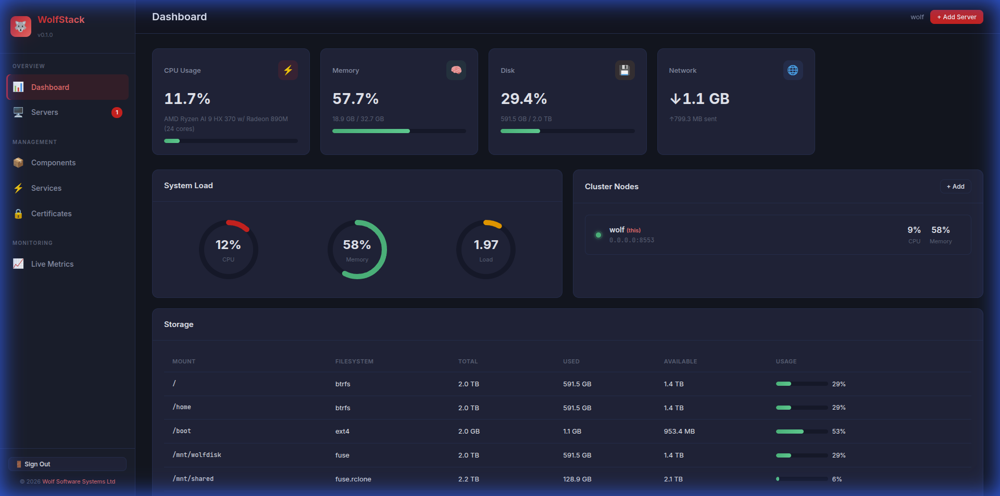

# 🐺 WolfStack — Server, VM & Container Management Platform

The flagship management dashboard for the [Wolf Software Systems](https://wolf.uk.com/) infrastructure suite. Monitor servers, manage **virtual machines (KVM/QEMU)**, Docker and LXC containers, control services, edit configurations, and view logs — all from one beautiful, Proxmox-like web interface.

**[Reddit Community (r/WolfStack)](https://www.reddit.com/r/WolfStack/)** • **[Discord](https://discord.gg/q9qMjHjUQY)** • **[Patreon](https://www.patreon.com/15362110/join)**



## Quick Install

```bash
curl -sSL https://raw.githubusercontent.com/wolfsoftwaresystemsltd/WolfStack/master/setup.sh | sudo bash
```

Then open `http://your-server:8553` and log in with your Linux system credentials.

## Why WolfStack?

WolfStack is the **central control plane** for your entire infrastructure. Instead of SSH-ing into every server and running commands manually, WolfStack gives you a single dashboard to:

- **Monitor** all your servers' CPU, memory, disk, and network in real time
- **Manage virtual machines** — create, start, stop, and delete KVM/QEMU VMs with in-browser noVNC console, Windows support, and multi-disk management
- **Manage Docker containers** — list, start, stop, restart, pause, remove, view logs, and see resource usage
- **Manage LXC containers** — list, start, stop, freeze, destroy, edit configs, and view logs
- **Control services** — start, stop, restart any systemd service across your fleet
- **Install software** — install Docker, LXC, and Wolf suite components with one click
- **Edit configs** — modify configuration files for any managed component directly in the browser
- **View logs** — read live journal logs for any service or container
- **Database editor** — built-in MariaDB/MySQL editor with table browser, data viewer, structure management (columns, indexes, triggers), and SQL query runner

## Features

### 🐳 Docker Container Management
- Auto-detects Docker installation and version
- Lists all containers with real-time CPU, memory, and PID stats
- Start, stop, restart, pause, unpause, and remove containers
- **Search Docker Hub** and pull images from the dashboard
- **Create containers** with ports, env vars, memory/CPU limits, and WolfNet IPs
- **Clone containers** — create a copy with one click
- **Migrate containers** to other WolfStack nodes
- **Manage images** — use existing images to create containers, or delete unused images
- View container logs with timestamps
- Browse Docker images with size and creation info
- **Web terminal** — interactive shell via xterm.js (WebSocket console)
- **Install Docker** from the dashboard if not already present

### 🖥️ Virtual Machine Management (KVM/QEMU)
- **Tabbed creation wizard** — General → Disks → Network & Boot
- Configurable CPU, memory, and disk size with multiple storage backends
- **OS disk bus selection** — VirtIO (fastest), IDE (Windows-compatible), SATA
- **Network adapter selection** — VirtIO (Linux), Intel e1000 (Windows built-in driver), Realtek RTL8139
- **VirtIO drivers ISO** — attach a secondary CD-ROM for Windows VirtIO driver installation
- **Multiple storage volumes** — add extra disks with custom size, format (qcow2/raw), bus type, and storage location
- **Volume management** — add, resize (grow-only), and remove volumes from the tabbed settings dialog
- Boot from ISO images for OS installation, boot order auto-configured for CD-first
- **In-browser VNC console** — noVNC-powered console directly in the dashboard (no external VNC client needed)
- **Tabbed settings dialog** — edit all VM settings (hardware, disks, network) without recreating the VM
- KVM hardware acceleration for near-native performance
- Automatic disk image management (qcow2 format)
- **WolfNet TAP networking** — assign WolfNet IPs to VMs for mesh network access
- Start, stop, and delete VMs from the dashboard
- QEMU/KVM installed automatically by setup.sh

#### Installing Windows in a VM
1. Set **OS Disk Bus** to `IDE` (Windows doesn't include VirtIO drivers)
2. Set **Network Adapter** to `Intel e1000` (Windows has built-in driver)
3. Point **ISO Path** to your Windows installer ISO
4. Optionally attach a **VirtIO Drivers ISO** if you want to switch to VirtIO later for better performance
5. Start the VM and open the **Console** to complete Windows installation

### 📦 LXC Container Management
- Auto-detects LXC installation and version
- Lists all LXC containers with resource stats
- **Browse LXC templates** — Debian, Ubuntu, Alpine, CentOS, Fedora, and more
- **Create containers** from any template with one click
- Start, stop, restart, freeze, unfreeze, and destroy containers
- **Clone containers** — full copy or snapshot (copy-on-write)
- View container logs via journalctl
- Read and edit LXC container configuration files
- **Web terminal** — interactive shell via xterm.js (WebSocket console)
- **Install LXC** from the dashboard if not already present

### 🚀 Container Migration
- Migrate Docker containers between WolfStack nodes with one click
- Automatically exports, transfers, and imports the container
- Works across your cluster — pair with WolfDisk for shared storage
- Option to remove the source container after migration or keep a copy

### 🌐 WolfNet Container Networking
- Assign WolfNet IPs (10.10.10.x) to Docker and LXC containers
- Containers become reachable across your entire WolfNet mesh
- IPs auto-applied on container start/restart
- Automatic IP allocation to avoid conflicts
- **WolfNet IPs displayed** in the dashboard even when containers are stopped

### 🌍 Public IP Mapping
- Map public IP addresses to WolfNet IPs (containers, VMs, LXC) from the dashboard
- Automatic iptables DNAT, SNAT, and FORWARD rule management
- Supports all ports or specific port/protocol combinations (TCP, UDP, or both)
- Mappings persist across reboots — stored in `/etc/wolfstack/ip-mappings.json`
- Survives container migration between servers
- Auto-detects available public IPs and WolfNet IPs for easy selection
- IP forwarding enabled automatically

### 📊 Real-Time Dashboard
- Live CPU, memory, disk, and network monitoring with 2-second refresh
- Animated SVG gauges for CPU, memory, and load average
- Smooth bezier-curve history charts
- Storage breakdown table showing all mounted filesystems
- Network interface statistics

### 📦 Component Management
- Auto-detects installed Wolf suite components (WolfNet, WolfDisk, WolfScale, WolfProxy, WolfServe)
- Detects MariaDB and Certbot
- **Drill-down detail view** for each component:
  - Service status, memory usage, PID, restart count
  - Start / Stop / Restart controls
  - **Config file editor** with Save button
  - **Live journal logs** from systemd

### 🖥️ Multi-Server Clustering
- Add remote servers and monitor them from one dashboard
- Works over WolfNet mesh VPN or direct IP
- Polls remote WolfStack instances for metrics and component status
- **Join token security** — servers must provide a valid token to join the cluster
- **Auto-purge** — unverified nodes are automatically removed on restart
- **Remote container management** — start, stop, restart, remove, clone, and migrate containers on any server in your cluster
- **Container count badges** — sidebar shows how many Docker and LXC containers each server has
- **Web terminal** — open an interactive shell on any server (local or remote) directly from the sidebar
- All API calls automatically proxied through the node proxy for remote servers

### 🔒 Linux Authentication
- Authenticates against your server's Linux user accounts (PAM/crypt)
- Session-based with 8-hour token lifetime
- All API routes protected

### ⚡ Service Control
- Start, stop, restart any systemd service
- Enable/disable services
- View service status across your fleet

### 🔐 SSL Certificates
- Request Let's Encrypt certificates via Certbot
- One-click certificate provisioning

### 🗄️ MariaDB/MySQL Database Editor
- Built-in Navicat-style database editor accessible from the dashboard
- **Auto-detects** local MySQL/MariaDB installations and Docker containers
- Connect to any MariaDB/MySQL server with hostname, port, username, and password
- **Database browser** — tree view of all databases and tables
- **Data tab** — view and browse table data with pagination
- **Structure tab** with sub-tabs:
  - **Columns** — view column definitions, add/drop columns, rename tables
  - **Indexes** — list, create (INDEX/UNIQUE/FULLTEXT), and drop indexes with non-blocking progress
  - **Triggers** — list, create (BEFORE/AFTER × INSERT/UPDATE/DELETE), and drop triggers
- **Query tab** — write and execute arbitrary SQL with result grid
- Destructive operations require typing "YES" to confirm, showing the exact SQL
- Compatible with MariaDB, MySQL, Percona, and Amazon RDS

### 🤖 AI Agent
- Built-in AI assistant powered by **Claude** or **Gemini**
- 🐺 Chat bubble in the bottom-right corner for instant help
- Ask questions about your servers, WolfStack, WolfNet, WolfDisk, WolfProxy, and WolfServe
- **Background health monitoring** — periodically checks system metrics and sends email alerts via SMTP
- Knowledge base loaded from your Wolf suite documentation
- **Dynamic model list** — fetches available models from the provider's API
- Configurable API keys, provider, model, email settings, and health check interval
- **Automatic update check** — compares running version to GitHub

### 🟠 Proxmox VE Integration

WolfStack supports Proxmox in two ways:

**Option 1: Install WolfStack on Proxmox** (recommended)
```bash
# SSH into your Proxmox node and run:
curl -sSL https://raw.githubusercontent.com/wolfsoftwaresystemsltd/WolfStack/master/setup.sh | sudo bash
```
Then add it to your cluster using a join token (see below). This gives you the full WolfStack dashboard on the Proxmox node.

**Option 2: Connect via Proxmox API** (remote monitoring only)
- **Unified datacenter** — manage Proxmox VE clusters alongside native WolfStack nodes in one dashboard
- **Multi-node cluster support** — auto-discovers all nodes in a Proxmox cluster and groups them under a named header in the sidebar
- **API token authentication** — secure connection using PVE API tokens (Token ID + Secret)
- **Live metrics** — CPU, memory, disk, and uptime polled from each Proxmox node via REST API
- **VM & container listing** — see all QEMU VMs and LXC containers with resource usage, progress bars, and status badges
- **Guest control** — start, stop, shutdown, reboot, suspend, and resume Proxmox VMs and containers from WolfStack
- **Console access** — one-click link to Proxmox noVNC console for running guests
- **TLS support** — works with self-signed certificates (common in Proxmox installations)

### 🔐 Join Token Security

WolfStack servers require a **join token** to be added to a cluster. This prevents unauthorized servers from joining.

- Each server generates a unique token on first startup, stored at `/etc/wolfstack/join-token`
- Get the token via CLI: `wolfstack --show-token`
- Get the token from the dashboard: open the "Add Server" modal — the token is shown at the bottom
- When adding a server, WolfStack calls the remote server's `/api/cluster/verify-token` endpoint
- Invalid tokens are rejected; unverified nodes are auto-purged on restart
- Proxmox nodes use their PVE API token instead (no join token needed)

#### Setting Up Proxmox Integration
1. **Create an API Token** in Proxmox: `Datacenter → Permissions → API Tokens → Add`
   - User: `root@pam` (or a dedicated user with appropriate roles)
   - Token ID: choose any name (e.g. `wolfstack`)
   - Uncheck "Privilege Separation" for full access, or assign `PVEAuditor` + `PVEVMUser` roles
2. **Set API Token Permissions** — the token needs at least `Sys.Audit` to read node status:

   **Option A: Via Proxmox Web UI**
   - Go to `Datacenter → Permissions → Add → API Token Permission`
   - Path: `/`
   - API Token: `root@pam!wolfstack`
   - Role: `PVEAuditor`
   - Propagate: ✅
   
   **Option B: Via Command Line**
   ```bash
   pveum aclmod / -token 'root@pam!wolfstack' -role PVEAuditor
   ```
   
   **Option C: Minimal custom role**
   ```bash
   pveum role add WolfStackMonitor -privs "Sys.Audit,VM.Audit,VM.PowerMgmt,Datastore.Audit"
   pveum aclmod / -token 'root@pam!wolfstack' -role WolfStackMonitor
   ```

3. **Copy the Token ID and Secret** — Proxmox shows these once:
   - Token ID: `root@pam!wolfstack`
   - Secret: `a2e0dcfb-f3eb-4674-965d-0dda7974ba73`
4. **Add to WolfStack** — click "+ Add Server", select "Proxmox VE", and enter:
   - **Cluster Name** — display name for the sidebar (e.g. "Production")
   - **Server Address** — IP or hostname only, no `https://`
   - **PVE Node Name** — as shown in Proxmox sidebar (e.g. `pve1`)
   - **Token ID** — from step 3 (e.g. `root@pam!wolfstack`)
   - **Token Secret** — from step 3
   - **TLS Fingerprint** — optional, leave blank for self-signed certs
5. WolfStack automatically discovers all nodes in the cluster and adds them
6. The cluster appears grouped in the sidebar with live metrics and VM/container counts

### Proxmox Troubleshooting

| Symptom | Cause | Fix |
|---------|-------|-----|
| Nodes show **offline** | API token lacks `Sys.Audit` | Follow Step 2 above to grant `PVEAuditor` role |
| `403 Permission check failed` in logs | Token permissions not propagated | Set path to `/` with **Propagate** checked |
| Wrong node name | PVE node name doesn't match | Check `Datacenter → Nodes` in Proxmox for exact name |

Check logs for detailed errors:
```bash
sudo journalctl -u wolfstack -f | grep -i proxmox
```

## Architecture

```
wolfstack/
├── src/
│   ├── main.rs              # HTTP server, background tasks
│   ├── api/mod.rs           # REST API endpoints (60+ routes)
│   ├── auth/mod.rs          # Linux auth via crypt(), session management
│   ├── agent/mod.rs         # Multi-server cluster state, polling
│   ├── ai/mod.rs            # AI agent (Claude/Gemini chat, health monitoring, email alerts)
│   ├── monitoring/mod.rs    # System metrics via sysinfo
│   ├── installer/mod.rs     # Component detection, install, systemd control
│   ├── networking/mod.rs    # Network interfaces, VLANs, DNS, IP mapping
│   ├── console.rs           # WebSocket PTY terminal for containers and host shells
│   ├── containers/mod.rs    # Docker & LXC management
│   ├── mysql_editor.rs      # MariaDB/MySQL database editor API
│   ├── proxmox/mod.rs       # Proxmox VE API client & polling
│   └── vms/                 # Virtual machine management
│       ├── mod.rs            # Module exports
│       ├── manager.rs        # KVM/QEMU VM lifecycle (create, start, stop, delete)
│       └── api.rs            # VM REST API endpoints
├── web/
│   ├── login.html           # Login page
│   ├── index.html           # Dashboard SPA
│   ├── css/style.css        # Dark theme design system
│   └── js/app.js            # Dashboard logic, charts, polling
├── setup.sh                 # One-line installer
├── Cargo.toml
└── README.md
```

## API

All endpoints require authentication (cookie-based session) except `/api/agent/status`.

### Authentication

| Method | Endpoint | Description |
|--------|----------|-------------|
| POST | `/api/auth/login` | Login with Linux credentials |
| POST | `/api/auth/logout` | Destroy session |
| GET | `/api/auth/check` | Check if session is valid |

### System Monitoring

| Method | Endpoint | Description |
|--------|----------|-------------|
| GET | `/api/metrics` | Current system metrics (CPU, memory, disk, network) |

### Cluster Management

| Method | Endpoint | Description |
|--------|----------|-------------|
| GET | `/api/nodes` | List all cluster nodes |
| POST | `/api/nodes` | Add a server to cluster (requires `join_token` for WolfStack nodes) |
| DELETE | `/api/nodes/{id}` | Remove a server |
| GET | `/api/auth/join-token` | Get this server's join token |
| GET | `/api/cluster/verify-token` | Verify a join token (unauthenticated, for inter-node use) |

### Component Management

| Method | Endpoint | Description |
|--------|----------|-------------|
| GET | `/api/components` | Status of all managed components |
| GET | `/api/components/{name}/detail` | Component detail (config, logs, stats) |
| PUT | `/api/components/{name}/config` | Save component config file |
| POST | `/api/components/{name}/install` | Install a component |

### Services & Certificates

| Method | Endpoint | Description |
|--------|----------|-------------|
| POST | `/api/services/{name}/action` | Start / stop / restart a service |
| POST | `/api/certificates` | Request Let's Encrypt certificate |

### Container Management

| Method | Endpoint | Description |
|--------|----------|-------------|
| GET | `/api/containers/status` | Docker & LXC runtime detection (installed, version, counts) |
| POST | `/api/containers/install` | Install Docker or LXC |

### Docker Containers

| Method | Endpoint | Description |
|--------|----------|-------------|
| GET | `/api/containers/docker` | List all Docker containers |
| GET | `/api/containers/docker/stats` | Docker container resource stats (CPU, memory, PIDs) |
| GET | `/api/containers/docker/images` | List Docker images |
| GET | `/api/containers/docker/search?q=` | Search Docker Hub for images |
| POST | `/api/containers/docker/pull` | Pull a Docker image from Docker Hub |
| POST | `/api/containers/docker/create` | Create a Docker container (name, image, ports, env, WolfNet IP) |
| GET | `/api/containers/docker/{id}/logs` | Docker container logs |
| POST | `/api/containers/docker/{id}/action` | Start/stop/restart/pause/unpause/remove container |
| POST | `/api/containers/docker/{id}/clone` | Clone a Docker container |
| POST | `/api/containers/docker/{id}/migrate` | Migrate container to another WolfStack node |
| DELETE | `/api/containers/docker/images/{id}` | Delete a Docker image |
| POST | `/api/containers/docker/import` | Receive a migrated container image (inter-node) |

### LXC Containers

| Method | Endpoint | Description |
|--------|----------|-------------|
| GET | `/api/containers/lxc` | List all LXC containers |
| GET | `/api/containers/lxc/stats` | LXC container resource stats |
| GET | `/api/containers/lxc/templates` | List available LXC templates (distro, release, arch) |
| POST | `/api/containers/lxc/create` | Create LXC container from template |
| GET | `/api/containers/lxc/{name}/logs` | LXC container logs |
| GET | `/api/containers/lxc/{name}/config` | Read LXC container config file |
| PUT | `/api/containers/lxc/{name}/config` | Save LXC container config file |
| POST | `/api/containers/lxc/{name}/action` | Start/stop/restart/freeze/unfreeze/destroy container |
| POST | `/api/containers/lxc/{name}/clone` | Clone container (full copy or snapshot) |

### Virtual Machines

| Method | Endpoint | Description |
|--------|----------|-------------|
| GET | `/api/vms` | List all VMs with status, resources, and VNC port |
| GET | `/api/vms/storage` | List available storage locations |
| POST | `/api/vms/create` | Create VM (name, cpus, memory, disk, iso, os_disk_bus, net_model, drivers_iso, extra_disks) |
| GET | `/api/vms/{name}` | Get details for a specific VM |
| PUT | `/api/vms/{name}` | Update VM settings (cpus, memory, disk, iso, bus, network adapter, drivers ISO, WolfNet IP) |
| DELETE | `/api/vms/{name}` | Delete a VM and its disk image |
| POST | `/api/vms/{name}/action` | Start or stop a VM |
| POST | `/api/vms/{name}/volumes` | Add a storage volume to a VM |
| DELETE | `/api/vms/{name}/volumes/{vol}` | Remove a storage volume |
| POST | `/api/vms/{name}/volumes/{vol}/resize` | Resize a storage volume (grow only) |

### Networking & IP Mappings

| Method | Endpoint | Description |
|--------|----------|-------------|
| GET | `/api/networking/interfaces` | List all network interfaces |
| GET | `/api/networking/dns` | Get DNS configuration |
| POST | `/api/networking/dns` | Set DNS nameservers and search domains |
| POST | `/api/networking/vlans` | Create a VLAN interface |
| DELETE | `/api/networking/vlans/{name}` | Delete a VLAN interface |
| GET | `/api/networking/ip-mappings` | List all public IP → WolfNet IP mappings |
| POST | `/api/networking/ip-mappings` | Create a new IP mapping |
| DELETE | `/api/networking/ip-mappings/{id}` | Remove an IP mapping |
| GET | `/api/networking/available-ips` | Auto-detect available public and WolfNet IPs |

### WolfNet & WebSocket

| Method | Endpoint | Description |
|--------|----------|-------------|
| GET | `/api/wolfnet/status` | WolfNet network status and peers |
| GET | `/api/wolfnet/used-ips` | List all used WolfNet IPs |
| WS | `/ws/console/{type}/{name}` | Interactive web terminal (Docker, LXC, or host) |

### Proxmox VE

| Method | Endpoint | Description |
|--------|----------|-------------|
| GET | `/api/nodes/{id}/pve/resources` | List VMs and containers on a Proxmox node |
| POST | `/api/nodes/{id}/pve/test` | Test Proxmox API connection |
| POST | `/api/nodes/{id}/pve/{vmid}/{action}` | Start/stop/shutdown/reboot a Proxmox guest |

### Node Proxy

| Method | Endpoint | Description |
|--------|----------|-------------|
| ANY | `/api/nodes/{id}/proxy/{path}` | Proxy any API call to a remote node |

### AI Agent

| Method | Endpoint | Description |
|--------|----------|-------------|
| GET | `/api/ai/config` | Get AI config (API keys masked) |
| POST | `/api/ai/config` | Save AI config (provider, keys, model, email settings) |
| POST | `/api/ai/chat` | Send a chat message to the AI assistant |
| GET | `/api/ai/status` | AI agent status (configured, provider, model, alerts) |
| GET | `/api/ai/alerts` | Historical health check alerts |
| GET | `/api/ai/models` | List available models for the configured provider |

### MariaDB/MySQL Editor

| Method | Endpoint | Description |
|--------|----------|-------------|
| POST | `/api/mysql/connect` | Test connection to a MySQL/MariaDB server |
| POST | `/api/mysql/databases` | List all databases on the server |
| POST | `/api/mysql/tables` | List tables in a database |
| POST | `/api/mysql/data` | Fetch paginated table data |
| POST | `/api/mysql/query` | Execute an arbitrary SQL query |

### Agent (No Auth)

| Method | Endpoint | Description |
|--------|----------|-------------|
| GET | `/api/agent/status` | Node status (for remote polling, no auth) |

## Requirements

- **Linux** (Debian/Ubuntu or RedHat/Fedora)
- **Rust 1.70+** (installed automatically by setup.sh)
- **Root access** (required for reading `/etc/shadow` and managing systemd services)
- **libcrypt** (installed automatically by setup.sh)
- **Port 8553** (default, configurable)

Optional:
- **Docker** — for Docker container management (can be installed from the dashboard)
- **LXC** — for LXC container management (can be installed from the dashboard)
- **QEMU/KVM** — for virtual machine management (installed automatically by setup.sh)

## Manual Build

```bash
cargo build --release
sudo ./target/release/wolfstack --port 8553
```

## Configuration

Config file: `/etc/wolfstack/config.toml`

```toml
[server]
port = 8553
bind = "0.0.0.0"
web_dir = "/opt/wolfstack/web"
```

## Managing the Service

```bash
# Status
sudo systemctl status wolfstack

# Logs
sudo journalctl -u wolfstack -f

# Restart
sudo systemctl restart wolfstack

# Stop
sudo systemctl stop wolfstack
```

## Part of the Wolf Suite

WolfStack is the management hub for all Wolf Software tools:

| Tool | Description |
|------|-------------|
| **WolfStack** | Server & container management dashboard (this project) |
| **WolfScale** | Database replication & load balancing |
| **WolfDisk** | Distributed filesystem replication |
| **WolfNet** | Encrypted mesh VPN networking |
| **WolfProxy** | NGINX-compatible reverse proxy with firewall |
| **WolfServe** | Apache2-compatible web server |

All tools are managed through WolfStack — install, configure, monitor, and control everything from one place.

## License

[Functional Source License (FSL-1.1-Apache-2.0)](LICENSE) — Free to use for any purpose except competing with Wolf Software Systems Ltd. Converts to Apache 2.0 after two years.

© 2024-2026 [Wolf Software Systems Ltd](https://wolf.uk.com/)
